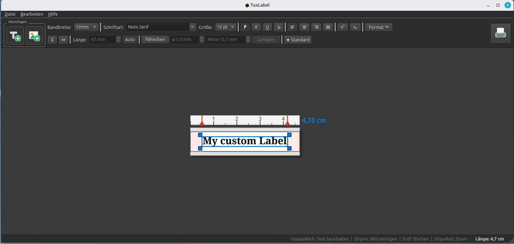

# TuxLabel

**Etiketten-Editor für Brother P-Touch Drucker (TZe-Bänder) unter Linux.**

*(English version below — [jump to English](#tuxlabel-english))*

TuxLabel ist ein Desktop-Programm für Linux, mit dem sich Etiketten für den
Brother PT-P700 gestalten und direkt über CUPS ausdrucken lassen — inklusive
maßstabsgetreuer Vorschau (WYSIWYG), Bildern und einem eigenen Modus für
Kabelfähnchen.



**[⬇ Herunterladen und installieren](../../releases/latest)** — für Ubuntu,
Linux Mint und Debian als `.deb`-Paket zum Doppelklicken, ohne Terminal.
[Andere Distributionen](#andere-distributionen--aus-dem-quellcode).

---

## Funktionen

**Bearbeiten**
* Textfelder mit freier Schriftart, -größe und -stil (fett, kursiv,
  unterstrichen, durchgestrichen), Ausrichtung links/zentriert/rechts/Blocksatz
* Bilder aus Datei oder direkt aus der Zwischenablage (`Strg+V`)
* Verschieben per Maus oder Pfeiltasten (1 mm, mit `Strg` in 0,1-mm-Schritten),
  Größenänderung über Anfasser
* Format übertragen von einem Textfeld auf ein anderes
* Elemente vertikal auf dem Band und horizontal auf dem Etikett zentrieren
* Rückgängig (bis zu 50 Schritte), Ausschneiden/Kopieren/Einfügen, Verdoppeln
* Datum und Uhrzeit einfügen (`F5`)

**Band und Etikett**
* Bandbreiten 3,5 / 6 / 9 / 12 / 24 mm — die druckbare Höhe entspricht Brothers
  Spezifikation, damit die Ausgabe physikalisch maßhaltig bleibt
* Lineal in Zentimetern, Zoom über `Strg`+Mausrad
* Feste Etikettenlänge oder **Auto**-Länge, die mit dem Inhalt mitwächst

**Kabelfähnchen-Modus**
* Teilt das Band in linkes Fähnchen · Mittelbalken · rechtes Fähnchen
* Der Mittelbalken wird aus dem Kabeldurchmesser berechnet (Umfang = π × ⌀),
  damit die Beschriftung nicht auf dem umschlungenen Kabel liegt
* Optionales Spiegeln der linken auf die rechte Hälfte und eine druckbare
  Falzlinie in der Mitte

**Drucken**
* Ausgabe über CUPS (`lp`) an den PT-P700
* Druckmodus wählbar: Linien-Modus für Text, Dithering für Fotos
* Prüfung, ob die eingestellte Bandbreite zum eingelegten Band passt

**Programm**
* Dateiformat `.ptle` (JSON, Koordinaten in Millimetern), Verlauf der zuletzt
  geöffneten Dateien
* Helles und dunkles Design
* Speicherbare Voreinstellungen für Bandbreite, Schriftart, -größe und -stil
* Mehrsprachig: Deutsch ist eingebaut, Englisch/Spanisch/Französisch liegen als
  JSON-Dateien bei — eigene Übersetzungen sind ohne Programmieren möglich
  (siehe [lang/README.md](lang/README.md))

## Installation

### Ubuntu, Linux Mint, Debian — ohne Terminal

1. Die **[Releases-Seite](../../releases/latest)** öffnen und unter *Assets*
   die Datei mit der Endung **`.deb`** anklicken — sie heißt
   `tuxlabel_<version>_all.deb`.

   > Nicht „Source code (zip)" oder „Source code (tar.gz)" nehmen! Das ist
   > der Quellcode für Entwickler und lässt sich nicht per Doppelklick
   > installieren.

2. Die heruntergeladene Datei **doppelklicken**. Die Paketverwaltung öffnet
   sich und fragt nach dem Passwort.
3. Fertig — **TuxLabel** steht im Anwendungsmenü unter *Büro*.

Alles Weitere geschieht von selbst: PyQt6 wird als Abhängigkeit
mitinstalliert, Menüeintrag und Programmsymbol kommen mit. Entfernen lässt
sich TuxLabel wie jedes andere Programm über die Anwendungsverwaltung.

Wer das Terminal bevorzugt:

```bash
sudo apt install ./tuxlabel_1.0.0_all.deb
```

### Andere Distributionen — aus dem Quellcode

Fedora, Arch, openSUSE und alles andere: TuxLabel ist reines Python, es muss
nichts kompiliert werden.

```bash
git clone https://github.com/Neklor/TuxLabel.git
cd TuxLabel
```

PyQt6 über die Paketverwaltung der Distribution installieren, zum Beispiel:

| Distribution | Befehl |
| --- | --- |
| Ubuntu / Mint / Debian | `sudo apt install python3-pyqt6 python3-pyqt6.sip` |
| Fedora | `sudo dnf install python3-pyqt6` |
| Arch / Manjaro | `sudo pacman -S python-pyqt6` |
| openSUSE | `sudo zypper install python3-qt6` |

Alternativ in einer virtuellen Umgebung:

```bash
python3 -m venv .venv
source .venv/bin/activate
pip install -r requirements.txt
```

Starten:

```bash
python3 main.py
```

Und optional einen Eintrag im Anwendungsmenü samt Desktop-Verknüpfung
anlegen — das Skript verändert nichts außerhalb des Benutzerverzeichnisses:

```bash
python3 install_shortcut.py
```

### Selbst ein .deb bauen

```bash
./tools/build-deb.sh          # Ergebnis: dist/tuxlabel_<version>_all.deb
```

Braucht `dpkg-deb` und PyQt6 (Letzteres nur, um die Programmsymbole zu
rendern). Die Versionsnummer zieht das Skript aus `tuxlabel/__init__.py`.

## Drucker einrichten

> **Das ist der Schritt, der wirklich Mühe macht** — nicht die Installation
> von TuxLabel. Ohne eingerichteten Drucker kannst du Etiketten entwerfen und
> speichern, aber nicht drucken.

TuxLabel rendert das Etikett in ein PNG mit 180 dpi und übergibt es via `lp`
an CUPS. Der Drucker muss also als CUPS-Drucker vorhanden sein. Nachsehen:

```bash
lpstat -p          # eingerichtete Drucker anzeigen
```

Erscheint der PT-P700 in dieser Liste, findet ihn auch der Druckdialog von
TuxLabel. Falls nicht, braucht es zuerst den Brother-CUPS-Treiber für das
Modell — den stellt Brother auf seinen Support-Seiten bereit; das ist ein
Schritt außerhalb von TuxLabel.

> **Hinweis:** Die im Werkzeugkasten eingestellte Bandbreite muss dem
> eingelegten TZe-Band entsprechen — sonst quittiert der PT-P700 den Auftrag
> mit rot blinkender Anzeige.

## Voraussetzungen

Bei der Installation über das `.deb`-Paket kümmert sich die Paketverwaltung
darum; diese Liste ist für alle anderen Wege gedacht.

* Linux (entwickelt und getestet unter Linux Mint / Ubuntu)
* Python **3.10** oder neuer
* PyQt6
* `cups-client` für den Befehl `lp` — nur zum Drucken
* CUPS mit eingerichtetem Brother-PT-P700-Treiber — nur zum **Drucken**
  erforderlich; Entwerfen und Speichern funktioniert auch ohne Drucker

Der Editor ist nicht an den PT-P700 gebunden — andere P-Touch-Modelle mit
CUPS-Treiber können funktionieren, sind aber ungetestet.

## Tastenkürzel

| Kürzel | Funktion |
| --- | --- |
| `Strg+N` / `Strg+O` / `Strg+S` | Neu / Öffnen / Speichern |
| `Strg+Umschalt+S` | Speichern unter |
| `Strg+Z` | Rückgängig |
| `Strg+X` / `Strg+C` / `Strg+V` | Ausschneiden / Kopieren / Einfügen |
| `Entf` | Löschen |
| `Strg+D` | Verdoppeln |
| `Strg+A` | Alles markieren |
| `F5` | Datum und Uhrzeit einfügen |
| Pfeiltasten | Um 1 mm verschieben |
| `Strg`+Pfeiltasten | Um 0,1 mm fein verschieben |
| `Strg`+Mausrad | Zoom |
| `Strg+P` | Drucken |

Die vollständige Liste steht im Programm unter *Hilfe → Tastenkürzel*.

## Projektstruktur

```
main.py                 Einstiegspunkt (QApplication, Sprache, Design)
install_shortcut.py     Legt Menüeintrag und Desktop-Verknüpfung an
requirements.txt        Python-Abhängigkeiten
tools/
  build-deb.sh          Baut das installierbare .deb-Paket
tuxlabel/
  main_window.py        Hauptfenster, Menüs, Werkzeugleiste
  label_canvas.py       Szene und Ansicht des Etiketts, Bandmaße, Fähnchen
  text_item.py          Textelement inkl. Inline-Editor
  image_item.py         Bildelement mit Größenanfassern
  printer.py            Rendern und Übergabe an CUPS
  serialization.py      Lesen und Schreiben des .ptle-Formats
  dialogs.py            Einstellungen, Über, Tastenkürzel, Hilfe
  i18n.py               Sprachverwaltung (Deutsch eingebaut)
  theme.py              Helles und dunkles Design
  icons.py              Zur Laufzeit gezeichnete Symbole
lang/                   Sprachdateien (en, es, fr) + Anleitung
```

## Ausblick

Heute ist TuxLabel auf Brother P-Touch zugeschnitten, entwickelt und getestet
am PT-P700. Das ist aber nur der Anfang: Ziel ist ein Etiketten-Editor für
Linux, der **Etikettendrucker verschiedener Hersteller** bedienen kann. Der
Editor selbst rechnet bereits in Millimetern und rendert seitenunabhängig — der
herstellerspezifische Teil steckt fast vollständig in
[tuxlabel/printer.py](tuxlabel/printer.py) und den Bandmaß-Tabellen in
[tuxlabel/label_canvas.py](tuxlabel/label_canvas.py).

Was dem im Weg steht, ist keine Programmierarbeit, sondern Hardware: Ein Modell
zuverlässig zu unterstützen heißt, es tatsächlich in der Hand zu haben —
Papierformate, Ränder und Treibereigenheiten lassen sich nicht erraten. Genau
dafür könnt ihr das Projekt unterstützen.

## Projekt unterstützen

TuxLabel entsteht in meiner Freizeit und ist kostenlos. Wenn es dir Arbeit
erspart, kannst du die Weiterentwicklung mit einer Spende unterstützen:

**→ [paypal.me/CKrogmann](https://paypal.me/CKrogmann)**

Es gibt zwei Wege, und du entscheidest über das **Nachrichtenfeld** von PayPal,
welchen du nimmst:

**1. Allgemein für das Projekt** — einfach ohne Nachricht senden. Fließt in
Pflege, Fehlerbehebung und neue Funktionen.

**2. Gezielt für ein Druckermodell** — die genaue Modellbezeichnung in die
Nachricht schreiben, zum Beispiel:

```
Für DYMO LabelManager 280
```

Spenden mit Modellangabe sammle ich pro Modell. Reicht der Betrag für das Gerät
plus passende Bänder, kaufe ich es und baue die Unterstützung ein. Das Modell
muss also benannt werden — ohne Angabe kann ich die Spende nicht zuordnen und
behandle sie als allgemeine Unterstützung.

Praktische Hinweise:

* Der Betrag lässt sich direkt in der Adresse vorwählen:
  [paypal.me/CKrogmann/25](https://paypal.me/CKrogmann/25)
* Welche Modelle bereits gewünscht wurden, steht in den
  [Issues mit dem Label `printer-request`](../../issues?q=label%3Aprinter-request).
  Fehlt dein Modell, eröffne gern ein Issue — auch ohne Spende: das zeigt,
  wofür Bedarf besteht.
* Über die Schaltfläche **Sponsor** oben auf der Projektseite geht es zum
  gleichen Link.

Spenden sind freiwillige Unterstützung eines privaten Freizeitprojekts. Sie
sind keine Bestellung und begründen keinen Anspruch auf eine bestimmte
Funktion, ein bestimmtes Modell oder einen Zeitplan — ich sage aber offen, wenn
ein Modell zusammengekommen ist und woran ich arbeite.

## Mitmachen

Fehlerberichte und Pull Requests sind willkommen. Besonders hilfreich:

* **Übersetzungen** — dafür ist kein Programmieren nötig, die Anleitung steht
  in [lang/README.md](lang/README.md)
* **Rückmeldungen zu anderen Modellen** — funktioniert der Druck? Das ist die
  billigste Art, die Hersteller-Unterstützung auszubauen: Wer ein Gerät schon
  besitzt, kann berichten, ohne dass ich es kaufen muss.

Bitte im Fehlerbericht die Linux-Distribution, die Python- und PyQt6-Version,
das Druckermodell sowie die betroffene Bandbreite angeben.

## Lizenz

GPL-3.0-or-later — siehe [LICENSE](LICENSE).

TuxLabel benutzt PyQt6, das seinerseits unter der GPL v3 steht.

Copyright © 2026 Christoph Krogmann

---

<a name="tuxlabel-english"></a>

# TuxLabel (English)

**A label editor for Brother P-Touch printers (TZe tapes) on Linux.**

TuxLabel is a Linux desktop application for designing labels for the Brother
PT-P700 and printing them straight through CUPS — with a true-to-scale
(WYSIWYG) preview, image support and a dedicated cable-flag mode.

### Features

* Text boxes with any font, size and style; left/centre/right/justified
  alignment
* Images from file or pasted from the clipboard (`Ctrl+V`)
* Move with the mouse or arrow keys (1 mm, or 0.1 mm with `Ctrl`), resize via
  handles, copy formatting between text boxes, centre elements on the tape
* Undo (up to 50 steps), insert date and time
* Tape widths 3.5 / 6 / 9 / 12 / 24 mm using Brother's printable-height specs,
  ruler in centimetres, `Ctrl`+wheel zoom
* Fixed label length or **Auto** length that grows with the content
* **Cable-flag mode:** splits the tape into left flag · centre bar · right
  flag, sizing the centre bar from the cable circumference (π × diameter) so
  the text never ends up wrapped around the cable; optional mirroring and a
  printable fold line
* Printing via CUPS (`lp`) with a line mode for text and dithering for photos,
  plus a check that the selected tape width matches the loaded tape
* `.ptle` file format (JSON, millimetre coordinates), recent-files list
* Light and dark theme, storable defaults
* Multilingual: German is built in; English, Spanish and French ship as JSON
  files, and adding your own translation requires no programming — see
  [lang/README.md](lang/README.md)

### Installation

**Ubuntu, Linux Mint, Debian — no terminal needed.** On the
**[releases page](../../releases/latest)**, download the file ending in
**`.deb`** (`tuxlabel_<version>_all.deb`) and double-click it — *not* the
"Source code" archives, which cannot be installed that way. The package
manager takes care of PyQt6, the menu entry and the icon; afterwards
**TuxLabel** sits in your application menu under *Office*. From a terminal
that is `sudo apt install ./tuxlabel_1.0.0_all.deb`.

**Other distributions — from source.** TuxLabel is pure Python, nothing needs
compiling:

```bash
git clone https://github.com/Neklor/TuxLabel.git
cd TuxLabel
sudo apt install python3-pyqt6 python3-pyqt6.sip   # dnf: python3-pyqt6 · pacman: python-pyqt6
python3 main.py
```

Run `python3 install_shortcut.py` to add an application-menu entry and a
desktop shortcut; it writes nothing outside your home directory. To build the
Debian package yourself, run `./tools/build-deb.sh`.

### Requirements

Handled automatically by the `.deb` package; this list applies to every other
route. Linux, Python **3.10+**, PyQt6, `cups-client` for the `lp` command, and
CUPS with a Brother PT-P700 driver. Only printing needs the last two —
designing and saving works without a printer. Other P-Touch models with a CUPS
driver may work but are untested.

**Setting up the printer is the step that actually takes effort**, not
installing TuxLabel. Check with `lpstat -p` whether your printer is a known
CUPS device; if it is not, you need Brother's CUPS driver for the model first,
which is a step outside TuxLabel.

Note that the tape width set in the toolbar must match the TZe tape actually
loaded, otherwise the PT-P700 rejects the job and blinks red. The full keyboard
shortcut list is available in the app under *Help → Keyboard shortcuts*.

### Roadmap

TuxLabel currently targets Brother P-Touch printers and is developed and tested
on the PT-P700 — but that is only the starting point. The goal is a Linux label
editor that drives **label printers from several manufacturers**. The editor
already works in millimetres and renders independently of any page format; the
vendor-specific part lives almost entirely in
[tuxlabel/printer.py](tuxlabel/printer.py) and the tape tables in
[tuxlabel/label_canvas.py](tuxlabel/label_canvas.py).

What stands in the way is hardware, not code: supporting a model reliably means
having it on the desk, because paper sizes, margins and driver quirks cannot be
guessed. That's exactly why you can support the project.

### Supporting the project

TuxLabel is free and built in my spare time. If it saves you work, you can
support its development with a donation:

**→ [paypal.me/CKrogmann](https://paypal.me/CKrogmann)**

PayPal's **message field** decides which of the two ways you choose:

**1. General support** — just send without a message. Goes into maintenance,
bug fixing and new features.

**2. Earmarked for a printer model** — put the exact model name in the message,
for example:

```
For DYMO LabelManager 280
```

Earmarked donations are pooled per model. Once a model reaches the price of the
device plus suitable tapes, I buy it and implement support. Naming the model is
what makes this work — without it I cannot attribute the donation and will treat
it as general support.

Practical notes:

* You can preset the amount in the URL:
  [paypal.me/CKrogmann/25](https://paypal.me/CKrogmann/25)
* Models requested so far are tracked in the
  [issues labelled `printer-request`](../../issues?q=label%3Aprinter-request).
  If yours is missing, feel free to open an issue — donation or not, it shows
  where the demand is.
* The **Sponsor** button at the top of the project page points to the same link.

Donations are voluntary support for a private hobby project. They are not an
order and create no entitlement to a particular feature, model or timeline — but
I will say openly when a model has been funded and what I am working on.

### Contributing

Bug reports and pull requests are welcome — translations especially, since they
need no programming. Reports about **other printer models** are just as
valuable: if you already own a device, your feedback expands vendor support
without anyone having to buy anything. When reporting a bug, please include your
distribution, your Python and PyQt6 versions, the printer model and the tape
width involved.

### License

GPL-3.0-or-later — see [LICENSE](LICENSE). TuxLabel uses PyQt6, which is itself
licensed under the GPL v3.

Copyright © 2026 Christoph Krogmann
